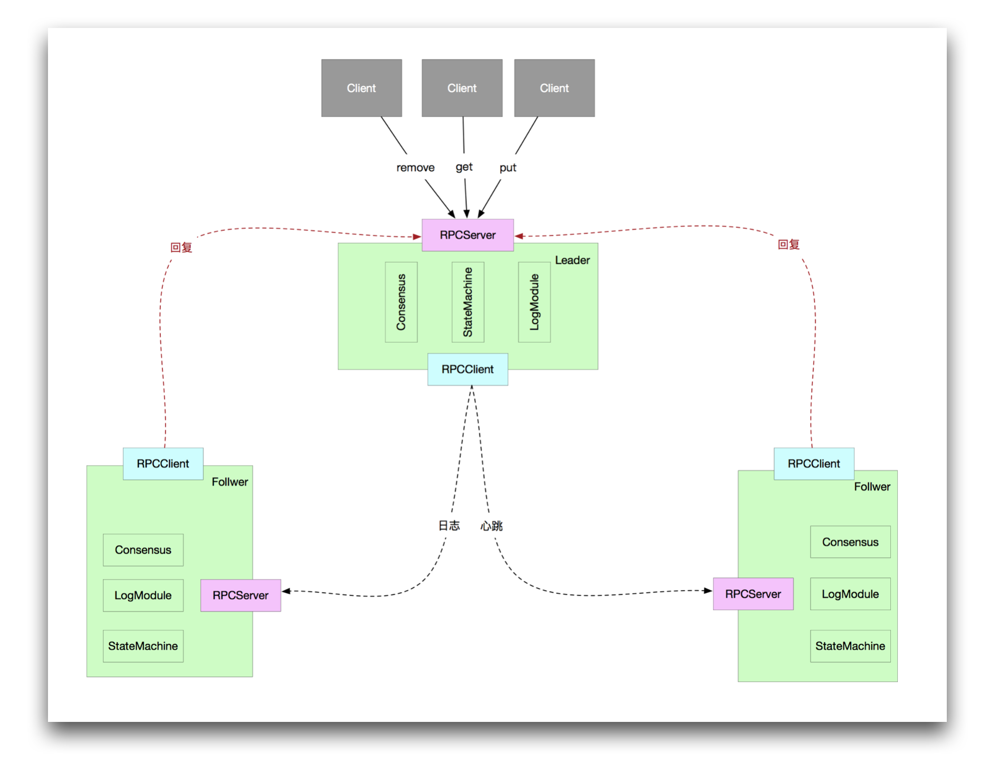

### Project Requirement ###
Oracle Java 8

Run mvn clean to remove things

Run Mavn Install to generate protobuf classes.

Then run the test. 

### Design Document ###
The program architecture is described as below

Taken from: https://github.com/stateIs0/lu-raft-kv



### TO Use the Application
java -jar $(path to package) -m (peer/controller) -p (Peer only, only 8258, 8259, 8260)

Example Command to run node:
```shell script
java -jar .\original-distributeddb-1.0-SNAPSHOT.jar -m peer -p 8259 -h localhost
```

Example Command to run controller
```shell script
java -jar .\original-distributeddb-1.0-SNAPSHOT.jar -m controller -h localhost
```


0. package generate the pakcage
```
cd distributeddb
mvn install
```

1. produce jar
```
mvn package
```

2. build image
```
docker build -t raft .
```

3. run peers using docker compose
```
docker-compose up -d
```

4. run controller to connect them
```
mvn exec:java -Dexec.args="-m controller"
```